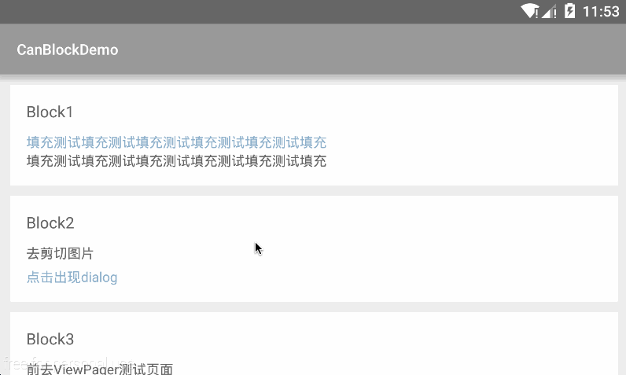

# CanBlock
为了将需要用到activity生命周期的功能从activity分离，为了将复杂布局分块显示，在一定程度上替代fragment。


<!--此项目参考了[UIBlock](https://github.com/tianzhijiexian/UIBlock)。-->

  

##添加依赖
```JAVA
compile 'com.canyinghao:canblock:1.0.1'
```

## 使用方式 
**1. 复杂布局分块显示**  
getCanBlockManager()的set方法是用来将Activity中的view在块中处理，replace方法是替换Activity中的view为块中的view，add方法是添加块中的view到Activity中来。
```JAVA
public class MainActivity extends CanBlockActivity {


    @Override
    protected void onCreate(Bundle savedInstanceState) {
        super.onCreate(savedInstanceState);

        setContentView(R.layout.activity_main);


        LinearLayout ll_main = (LinearLayout) findViewById(R.id.ll_main);

        LinearLayout ll_block = (LinearLayout) findViewById(R.id.ll_block1);
        View block2 = findViewById(R.id.block2);

        getCanBlockManager().set(new Block1(), ll_block).replace(new Block2(), block2).add(new Block3(), ll_main);


    }


}
``` 
R.layout.activity_main文件
```JAVA
<?xml version="1.0" encoding="utf-8"?>

<ScrollView xmlns:android="http://schemas.android.com/apk/res/android"
    android:layout_width="match_parent"
    android:layout_height="match_parent">

    <LinearLayout
        android:id="@+id/ll_main"
        android:layout_width="match_parent"
        android:layout_height="match_parent"
        android:orientation="vertical">


        <LinearLayout
            android:id="@+id/ll_block1"
            android:layout_width="match_parent"
            android:layout_height="wrap_content"
            android:layout_marginLeft="@dimen/dimen_normal"
            android:layout_marginRight="@dimen/dimen_normal"
            android:layout_marginTop="@dimen/dimen_normal"
            android:background="@color/white"
            android:orientation="vertical"
            android:padding="@dimen/dimen_normal_big">

            <LinearLayout
                android:layout_width="match_parent"
                android:layout_height="wrap_content"
                android:layout_marginBottom="@dimen/dimen_normal">

                <TextView
                    android:id="@+id/tv_title"
                    android:layout_width="0dp"
                    android:layout_height="wrap_content"
                    android:layout_weight="1"
                    android:text="@string/app_hint"
                    android:textColor="@color/black2"
                    android:textSize="@dimen/text_normal" />


            </LinearLayout>

            <TextView
                android:id="@+id/tv_add"
                android:layout_width="match_parent"
                android:layout_height="wrap_content"

                android:drawablePadding="@dimen/dimen_normal"
                android:text="@string/app_hint_long"
                android:textColor="@color/color_text"
                android:textSize="@dimen/text_small_little" />

            <TextView
                android:id="@+id/tv_notice"
                android:layout_width="match_parent"
                android:layout_height="wrap_content"


                android:text="@string/app_hint_long"
                android:textColor="@color/black2"
                android:textSize="@dimen/text_small_little" />


        </LinearLayout>


        <View
            android:id="@+id/block2"
            android:layout_width="match_parent"
            android:layout_height="wrap_content" />


    </LinearLayout>

</ScrollView>
``` 
**2. 需要activity生命周期的功能的分离**  
可以将第三方登录分享、图片选择剪切等功能分离。调用系统选择图片剪切图片功能需要用到onActivityResult方法，使用CanBlock就可以将剪切图片功能完全分离。
```JAVA
public class Block2 extends CanBlock {

    TextView tv_notice;
    CutImgHelper cutImgHelper;

    @Override
    public void initView() {

        setContentView(R.layout.block);

        LinearLayout ll_block = (LinearLayout) findViewById(R.id.ll_block);

        TextView tv_title = (TextView) findViewById(R.id.tv_title);


        TextView tv_add = (TextView) findViewById(R.id.tv_add);

        tv_notice = (TextView) findViewById(R.id.tv_notice);

        tv_title.setText("Block2");
        tv_add.setText("去剪切图片");
        tv_notice.setText("点击出现dialog");

        cutImgHelper = new CutImgHelper();

        getCanBlockActivity().getCanBlockManager().add(cutImgHelper, ll_block);

    }

    @Override
    public void initListener() {

        tv_notice.setOnClickListener(new View.OnClickListener() {
            @Override
            public void onClick(View view) {
                cutImgHelper.showOptionsDialog(true);
            }
        });
    }

    @Override
    public void initData() {

    }
}
``` 
剪切图片的类
```JAVA
public class CutImgHelper extends CanBlock {


    private final int FROM_CAMERA = 0;
    private final int FROM_PHOTO = 1;
    private final int FROM_CUT = 2;


    private int cutW;
    private int cutH;
    private int fromid;

    public static final String FILE_IMG = "temp";
    public static final String TAG = "CutImgHelper";


    private File saveFile;

    private boolean isCrop;

    @Override
    public void initView() {
        View v = new View(context);
        setContentView(v);

        v.setVisibility(View.GONE);

        cutW = getScreenDisplayMetrics().widthPixels;
        cutH = cutW / 2;


    }

    @Override
    public void initListener() {

    }

    @Override
    public void initData() {

    }

    public CutImgHelper() {
        super();
    }

    public CutImgHelper(int fromid) {
        super();
        this.fromid = fromid;
    }

    public void setWHsize(int cutW, int cutH) {
        this.cutW = cutW;
        this.cutH = cutH;
    }


    // 选择图片来源
    public void showOptionsDialog(final boolean isCrop) {

        this.isCrop = isCrop;

        saveFile = new File(getActivity().getExternalCacheDir(), FILE_IMG + System.currentTimeMillis() + ".jpg");

        String[] items = new String[]{"拍照", "选择本地图片"};

        DialogInterface.OnClickListener click = new DialogInterface.OnClickListener() {
            @Override
            public void onClick(DialogInterface dialog, int which) {
                switch (which) {
                    case 0:// 拍照

                        if (Environment.getExternalStorageState().equals(
                                Environment.MEDIA_MOUNTED)) {
                            Intent intentFromCapture = new Intent(
                                    MediaStore.ACTION_IMAGE_CAPTURE);
                            intentFromCapture.putExtra(MediaStore.EXTRA_OUTPUT, Uri
                                    .fromFile(saveFile));
                            getActivity().startActivityForResult(intentFromCapture, FROM_CAMERA);
                        }
                        break;
                    case 1:// 选择本地图片


                        if (isCrop) {
//							AlbumUtil.gotoCrop(getActivity(), false);
//						Intent intentFromGallery = new Intent();
//						intentFromGallery.setType("image/*"); // 设置文件类型
//						intentFromGallery.setAction(Intent.ACTION_GET_CONTENT);
//						getActivity().startActivityForResult(intentFromGallery, FROM_PHOTO);
                            Intent picture = new Intent(
                                    Intent.ACTION_PICK,
                                    MediaStore.Images.Media.EXTERNAL_CONTENT_URI);
                            getActivity().startActivityForResult(picture, FROM_PHOTO);
                        } else {
//							AlbumUtil.gotoAlbum(getActivity(),null,5);
                        }


                        break;
                }
            }
        };

        new AlertDialog.Builder(context).setItems(items, click).show()
                .setCanceledOnTouchOutside(true);
    }

    @Override
    public void onActivityResult(int requestCode, int resultCode, Intent data) {

        super.onActivityResult(requestCode, resultCode, data);
        if (resultCode == Activity.RESULT_OK) {
            switch (requestCode) {
                case FROM_CAMERA:

                    if (isCrop) {

                        startPhotoZoom(Uri.fromFile(saveFile));
                    } else {
                        ArrayList<String> list = new ArrayList<>();
                        list.add(saveFile.getAbsolutePath());
//						CanBus.getDefault().post(list,CanBus.CANBUS_IMG);
                    }


                    break;
                case FROM_PHOTO:
                    if (data != null) {
                        if (data == null) {
//							PhoneHelper.getInstance().show("抱歉无法获取到该手机相册权限，请拍照上传");
                            return;
                        }
                        try {
                            Uri selectedImage = data.getData();
                            String[] filePathColumns = {MediaStore.Images.Media.DATA};
                            Cursor c = context.getContentResolver().query(selectedImage, filePathColumns, null, null, null);
                            c.moveToFirst();
                            int columnIndex = c.getColumnIndex(filePathColumns[0]);
                            String picturePath = c.getString(columnIndex);
                            if (!picturePath.contains("file://")) {
                                picturePath = "file://" + picturePath;
                            }
                            startPhotoZoom(Uri.parse(picturePath));
                        } catch (Exception e) {
                            String file = data.getData().toString();
                            if (!file.contains("file://")) {
                                file = "file://" + file;
                            }
                            startPhotoZoom(Uri.parse(file));
                        }
                    }
                    break;
                case FROM_CUT:
                    if (data != null) {
                        savePhoto();

                    }
                    break;
//				case AlbumUtil.REQUEST_CODE_SEND_PICTURE:
//					if (data!=null){
//
//						ArrayList<String>   list= data.getStringArrayListExtra(AlbumUtil.DRR);
//						CanBus.getDefault().post(list,CanBus.CANBUS_IMG);
//
//					}
//
//
//
//					break;
                default:
                    break;
            }
        }
    }


    private void savePhoto() {


        if (saveFile.exists()) {

//				Intent intent = new Intent();
//				intent.putExtra(Constants.bean,saveFile.getAbsolutePath());
//				intent.putExtra(Constants.CUT_IMAGE_FROM_ID,fromid);
//				CanBus.getDefault().post(intent, CanBus.CANBUS_CROP_RESULT);
//				Toast.makeText(context, "save", Toast.LENGTH_SHORT).show();


        }


    }


    /**
     * 裁剪图片方法实现
     */
    private void startPhotoZoom(Uri uri) {

        Intent intent = new Intent("com.android.camera.action.CROP");
        intent.setDataAndType(uri, "image/*");
        intent.putExtra("crop", "true");
        intent.putExtra("aspectX", cutW);
        intent.putExtra("aspectY", cutH);
        intent.putExtra("outputX", cutW);
        intent.putExtra("outputY", cutH);
        intent.putExtra("noFaceDetection", true);
        intent.putExtra("scale", true);
        intent.putExtra("scaleUpIfNeeded", true);
        intent.putExtra("return-data", false);
        intent.putExtra(MediaStore.EXTRA_OUTPUT, Uri.fromFile(saveFile));
        intent.putExtra("outputFormat", Bitmap.CompressFormat.JPEG.toString());


        getActivity().startActivityForResult(intent, FROM_CUT);
    }


    public DisplayMetrics getScreenDisplayMetrics() {
        WindowManager manager = (WindowManager) context
                .getSystemService(Context.WINDOW_SERVICE);

        DisplayMetrics displayMetrics = new DisplayMetrics();
        Display display = manager.getDefaultDisplay();
        display.getMetrics(displayMetrics);

        return displayMetrics;

    }
}
```
**3. viewpager的另一种实现**  
功能尚不完全，尚需调整，慎用。
```JAVA
public class ViewPagerTestActivity extends CanBlockActivity {
    CanRecyclerViewPager viewPager;

    @Override
    protected void onCreate(Bundle savedInstanceState) {
        super.onCreate(savedInstanceState);

        setContentView(R.layout.activity_viewpager);

        viewPager = (CanRecyclerViewPager) findViewById(R.id.viewpager);


        LinearLayoutManager layout = new LinearLayoutManager(this, LinearLayoutManager.HORIZONTAL,
                false);
        viewPager.setLayoutManager(layout);


        CanBlockManager manager = getCanBlockManager().addPager(new BlockPager(1), this).addPager(new BlockPager(2), this).addPager(new BlockPager(3), this);

        CanBlockPagerAdapter adapter = new CanBlockPagerAdapter(viewPager, manager.getList());


        viewPager.setAdapter(adapter);

        viewPager.setHasFixedSize(true);
        viewPager.setLongClickable(true);
        viewPager.setOnePage(true);


    }


}
```


### 开发者

 

canyinghao: <canyinghao@hotmail.com>  


### License

    Copyright 2016 canyinghao

    Licensed under the Apache License, Version 2.0 (the "License");
    you may not use this file except in compliance with the License.
    You may obtain a copy of the License at

       http://www.apache.org/licenses/LICENSE-2.0

    Unless required by applicable law or agreed to in writing, software
    distributed under the License is distributed on an "AS IS" BASIS,
    WITHOUT WARRANTIES OR CONDITIONS OF ANY KIND, either express or implied.
    See the License for the specific language governing permissions and
    limitations under the License.
